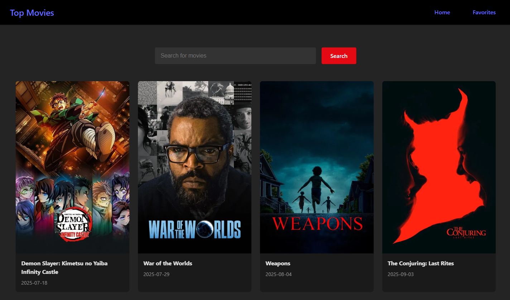

# React+Vite Movie Theatres(Responsive)

Demo：https://kaden175ck.github.io/My-Movie-Frontend/



## Installation Steps

Please follow the instructions below:

```
git clone https://github.com/kaden175ck/MY-MOVIE-FRONTEND.git
cd MY-MOVIE-FRONTEND
npm install
npm run dev
```

After running these commands, Vite will start the development server, and the terminal will display a localhost URL. Simply paste that URL into your browser to view the application.
